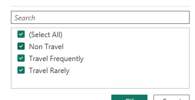
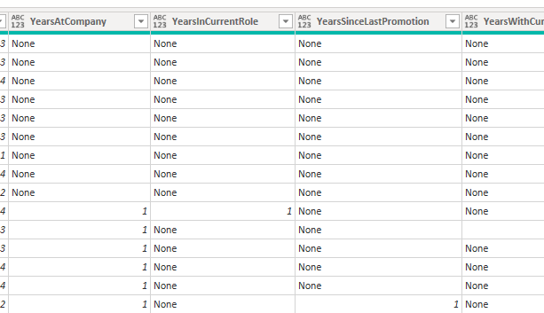
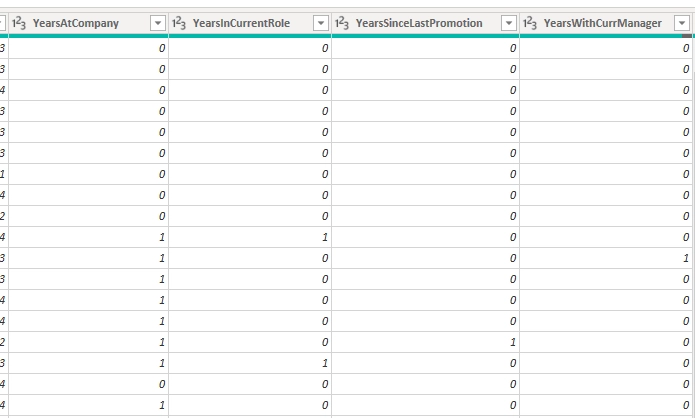
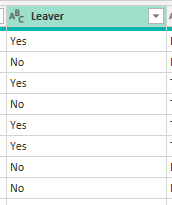
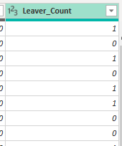
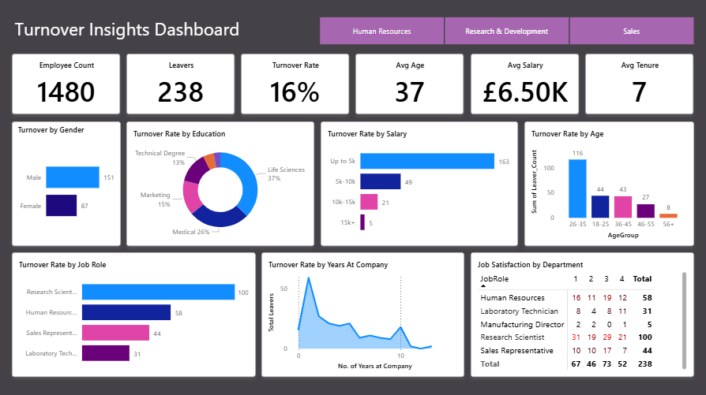

# Employee-Turnover

## PROJECT OVERVIEW

This project analyses employee data to identify the key factors that may affect employee turnover. Using Power BI, I performed exploratory analysis to uncover insights and trends related to turnover

## DATA CLEANING

There were some discrepancies with the data so I went ahead and cleaned it in Power Query.

- Tidied inconsistent formatting in the BusinessTravel

| Before | After |
| ----------- | ----------- |
|  |  |

- Replaced values “None” to 0 to avoid broken calculations
  
| Before | After |
| ----------- | ----------- |
|  |  |

- Added a conditional column for for the “Leaver” column and replaced the values of Yes and No to 1 and 0 to allow for easier calculations when creating the visuals.
| Before | After |
| ----------- | ----------- |
|  |  |

## HIGHLIGHTS

- A large proportion of the employees that have left the company are male, out of 238 leavers, 151 were male
- The age group with the highest turnover rate is 26-35 making up 49% of total leavers
- Majority of the employees that leave the company, leave within the first year
- Employees in the Research Scientist role has the highest turnover and also the greatest number of dissatisfied employees, as indicated by a job satisfaction of 1

## VISUALISATION

Produced a 1 page dashboard in Power BI
insert image of dashboard

